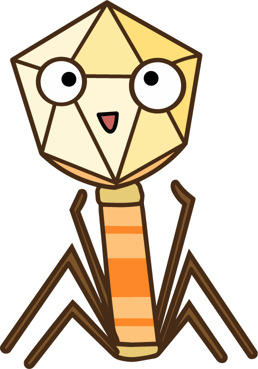
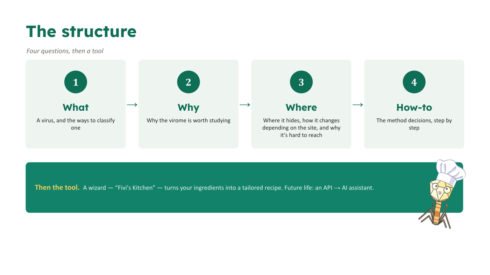
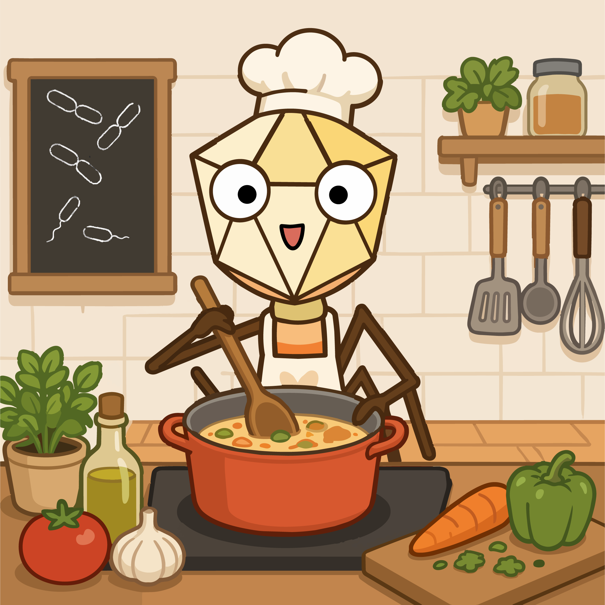

# Virome City: Adventures in the human virome
**A guide to navigate &amp; analyze your first human virome -and not get lost trying.**

This is a repository of the creation of an illustrated, interactive tool (book/website) guide that walks a researcher from a human‑virome
sample **idea**, to all the following challenges, to the analysis.


 
> Built for a **mixed audience** — PhD/postdoc experts *and* beginning students.
> Designed to be fun and easy to follow, while still holding all the technical detail.
> A few mascots guide the journey, and **Fivi** (a bacteriophage) is the main one. 


---
## 📖 What this is
 
Human viromes are tiny, noisy, and sample‑dependent. Small early choices
(which sample, which enrichment, DNA/RNA, which pipeline) quietly decide what you
can see at the end. This guide makes those choices **legible**.
 
The book is framed as four questions, then a tool:
 
**What → Why → Where → How‑to**, then the **Wizard** ("Fivi's Kitchen") → future **API/AI**.



## 📚 What's in each chapter
 
Before running a virome analysis, it helps to have a few things clear — and that's what
this guide gives you: the foundations you need to start thinking about the viral world we
live in.
 
- **[What](https://nickole97.github.io/ViromeCity/sections/what.html)** — we define what a virus is: its anatomy, what it's
  made of, and the ways it can be categorized.
- **[Why](https://nickole97.github.io/ViromeCity/sections/why.html)** — three to four short, comic‑style sections telling real,
  historical stories of how studying viromes has shaped human health. [IN PREP]
- **[Where](https://nickole97.github.io/ViromeCity/sections/where.html)** — we start asking where viruses are found, and — especially
  in the human body — how the way we search for them changes depending on several factors.
- **[How‑to](https://nickole97.github.io/ViromeCity/sections/how-to.html)** — finally, which of everything you just learned you
  need to account for when designing your experiment, from sampling all the way to the
  bioinformatic analysis.
  
## 🍳 Then the tool — Fivi's Kitchen

After all the context, you should know *what* a virus is, *why* it matters, *where* it hides, and
*how* the methods work. **[Fivi's Kitchen](https://nickole97.github.io/ViromeCity/kitchen/)**
turns all of that into a recipe: pick your sample, your target and your experience, and Fivi
cooks a method plan for your exact case — including the times when the honest answer is
*"you don't need metagenomics at all."*
 
<a href="https://nickole97.github.io/ViromeCity/kitchen/">
  
</a>
> 🍳 **[Open Fivi's Kitchen →](https://nickole97.github.io/ViromeCity/kitchen/)**


## 🗺️ Sections & status
 
| Section | What's in it | Status |
|---|---|---|
| ① Welcome | Importance of the virome + the What/Why/Where framing | ⬜ Pending |
| ①a What | What a virus is · anatomy of a virion · morphologies · **3 classification axes** | ✅ Draft |
| ② Why | Human evolution · Ecological · Medical · Life itself | ⬜ Pending |
| ③ Where | Everywhere but tiny → shotgun → composition → body heatmap → the noise problem | ✅ Draft |
| ④ How‑to | Convert (RT) · enrich (VLP) · platform · bioinformatics → decision tree | ✅ Draft |
| Wizard | "Fivi's Kitchen" → tailored recipe → future API/AI | 🧪 Prototype |
 
**The three classification axes** (inside What): **Host** · **Gene content** · **State/lifestyle**.
 
---
 
## 📂 Repository layout
 
```
ViromeCity/
├── README.md                 ← you are here
├── docs/                     ← the published book (GitHub Pages)
│   ├── sections/             ← what / where / how-to (.html)
│   ├── components/           ← body heatmap (interactive + small-multiples)
│   └── assets/               ← css · img (Fivi) · data
├── data/                     ← source datasets + references
│   └── references.md
└── planning/                 ← behind the scenes (All in prep)
    ├── overview.pptx          ← project deck
    ├── skeleton.md            ← the annotated content skeleton
    └── decisions.md           ← the running decision log
```
 
---
 
## 🎨 Design status
 
Content first, design later — on purpose. The **Virome City** visual identity
(watercolor / city‑street motif, cover, palette) is deferred to the end so the design
serves finished content instead of forcing it.
 
---
 
## 🚀 Viewing locally
 
Every section is a self‑contained HTML file — just open it in a browser.
Once published via GitHub Pages, the book will live at
`https://nickole97.github.io/ViromeCity/`.
