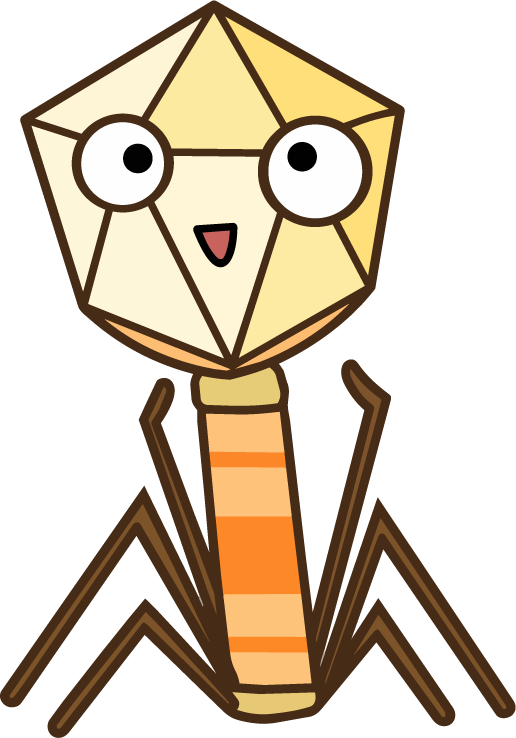

::: hero
{fig-alt="Fivi, a bacteriophage, the guide through this book"}

::: hero-text
Hi — I'm **Fivi**, a bacteriophage.

I'll walk you through your first virome. Four questions, then we cook.

*Built for a mixed audience: researchers who want the technical detail, and
students meeting the virome for the first time.*
:::
:::

Human viromes are tiny, noisy, and sample-dependent. Small early choices — which
sample, which enrichment, DNA or RNA, which pipeline — quietly decide what you can
see at the end.

This guide makes those choices **legible**.

## The route {.beat}

Four questions, in order — then the tool that turns your answers into a method.

::: route

::: stop
[District 1]{.q}
[How should I think about viruses?](sections/what.qmd){.stop-title}

What a virus is made of, and the three questions that decide your method: who it
infects, what genome it carries, and what state it is in.
:::

::: {.stop .pending}
[Why]{.q}
[Why the virome matters](sections/why.qmd){.stop-title}

Short comic-style stories of how studying viromes has shaped human health —
evolution, ecology, medicine.
:::

::: stop
[Where]{.q}
[Where viruses hide](sections/where.qmd){.stop-title}

Everywhere, but tiny. How the way you search changes across the body — and where
the noise comes from.
:::

::: stop
[How-to]{.q}
[How to design the experiment](sections/how-to.qmd){.stop-title}

Convert, enrich, sequence, analyze. What all of the above means for your protocol,
from sampling to bioinformatics.
:::

::: stop
[Then the tool]{.q}
[Fivi's Kitchen](sections/kitchen.qmd){.stop-title}

Pick your sample, your target and your experience. Fivi cooks a method plan for
your exact case — including the times when the honest answer is *"you don't need
metagenomics at all."*
:::

:::

## How to read this {.beat}

The chapters build on each other, so the first time through, read them in order.
After that, the sidebar and the search box are there for looking things up.

Each page ends with a link to the next one. If you only have ten minutes and a
sample in the freezer, skip to [Fivi's Kitchen](sections/kitchen.qmd) — it will
tell you what you still need to go back and read.

## Status {.beat}

Content first, design later — on purpose. The Virome City visual identity
(watercolor, city-street motif, cover) is deferred until the writing is done, so
that the design serves finished content instead of forcing it.

| Chapter | Status |
|---------|--------|
| What    | Written |
| Why     | In preparation |
| Where   | Earlier draft |
| How-to  | Earlier draft |
| Fivi's Kitchen | Live |

: {tbl-colwidths="[70,30]"}

The chapters still marked *earlier draft* were written by hand before the book
moved here. They stay readable while they wait their turn — see the
[earlier drafts](legacy/index.html).
