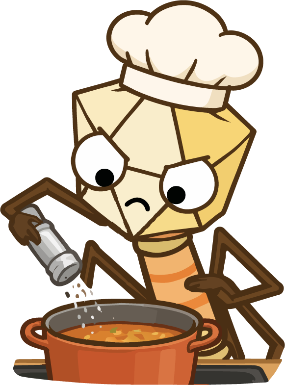

[District 4]{.district}

## The short answer

::: block
From District 1 you know three things about a virus: who it infects, what
genome it carries, and what state it is in.

[Two of those now decide your molecular biology.]{.claim}

The genome type decides whether the sequencer can read it at all. The physical
state decides whether enrichment will find it or destroy it. Everything in this
chapter follows from those two.
:::

## Does the sequencer need a copy first?

::: block
Sequencers read double-stranded DNA. Whatever your genome is, it has to get
there first — and how far it has to travel depends on what it started as.

- [1]{.n} [**RNA** — reverse transcription, RNA to cDNA.]{.t}
- [2]{.n} [**Single-stranded** — second-strand synthesis.]{.t}
- [3]{.n} [**Double-stranded DNA** — already there.]{.t}

Then library prep, and into the run.

{#fig-rt fig-alt="Six panels showing reverse transcription: viral RNA template, priming with random hexamers, extension by RT enzyme, RNA cleared by RNase H, second strand by DNA polymerase, and the finished double-stranded product."}
:::

::: methodology
Viral RNA rarely has a poly-A tail, so the priming step cannot rely on one. That
is why the protocol uses random hexamers rather than oligo-dT — a detail that
decides whether you recover an RNA virome at all.
:::

## Should I enrich?

::: block
Remember the noise problem from District 3: the virus is a sliver under
everything else. There is a way to lift that fraction before sequencing —
**VLP enrichment**, for virus-like particles.

The principle is a series of gates, each removing things by a physical property.
Filter out cells and debris by size; digest free nucleic acid with nucleases.
What survives is encapsidated: a genome inside a protein shell is protected from
the enzymes, and everything naked is not.

{#fig-vlp fig-alt="Seven panels of a VLP enrichment protocol: chip and weigh frozen stool, homogenise in SM buffer, clarify by centrifugation, filter at 0.45 micrometres, digest with lysozyme and DNase, stop with EDTA, and extract on a MagNA Pure."}
:::

## When does enrichment cost more than it gains?

::: block
Enrichment is not free, and it is not always right. It removes things — and
some of what it removes is what you came for.
:::

::: embed
[One sample, three protocols]{.embed-title}

The same population enters VLP enrichment, bulk shotgun and probe capture. Each
gate removes particles by a physical property — diameter at the filter, buoyant
density at the gradient, capsid protection at the nuclease, panel membership at
hybridisation. Watch what reaches sequencing.

```{=html}
<iframe src="../components/enrichment-simulator.html" title="One sample, three protocols: VLP enrichment, bulk shotgun and probe capture compared" loading="lazy"></iframe>
```

::: embed-out
[Open full ↗](../components/enrichment-simulator.html){target="_blank"}
:::
:::

::: methodology
**An integrated target does not survive it.** A provirus, a prophage or an ERV
is not a free particle: it sits inside a host genome, so the filter removes it
with the cell and the nuclease digests what is left. If you are looking for
integrated viruses, skip VLP and sequence total nucleic acid.
:::

::: methodology
**Very low biomass does not survive it either.** Blood, CSF and other sparse
sites give you little material to begin with, and every gate loses some. Do not
filter; sample with great care instead, and carry heavy controls and replicates.
:::

## Which platform?

::: block
The bench work is done; what is left is the sequencer. That choice is driven by
your question, not by your sample.

**Short reads are the default, and for most viromes they are also the right
answer.** They cost less, they go deeper for the same money, and every tool in
the next district was built for them. If you are asking what is there and how
much of it, stop here.

**Long reads earn their cost when the question is structural.** Where a prophage
sits in its host chromosome, whether two contigs belong to one genome, what a
repeat is hiding — those answers are longer than a short read, so no amount of
depth will settle them.
:::

::: block
Look back at how many forks this district asked you to take: the genome you are
chasing, the state it is in, the site it came from, whether to enrich, and now
the platform. None of them is decided on its own, and no chapter can decide them
for your sample.

So we built something that takes the details of your experiment and works them
through for you.
:::

::: launch
{fig-alt="Fivi, seasoning a pot."}

[Fivi's Kitchen]{.launch-title}

Tell it what you have and what you are after — the site you sampled, whether you
want one virus or a community, whether integrated viruses count, which genomes —
and Fivi runs this district's forks against your case and hands back a method
plan: the steps you need, in what order, and what each one costs you.

::: launch-links
[Open the kitchen ↗](../kitchen/index.html){target="_blank"}
:::
:::

::: fivi
{fig-alt="Fivi, thinking."}

**That is the bench done.** Everything so far decided what physically reaches the
sequencer. What comes back is a pile of reads, and none of it is sorted yet —
that is the [next district](bioinformatics.qmd).
:::
