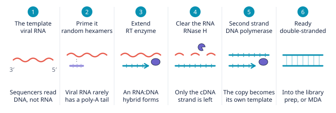
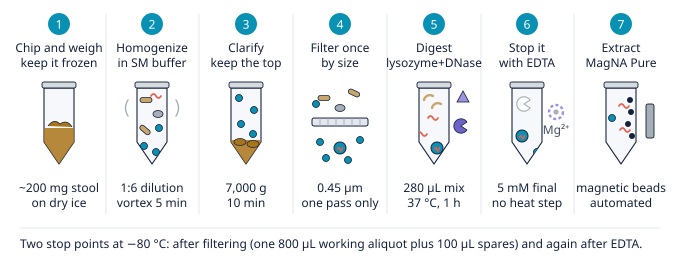

[District 4]{.district}

## The short answer

::: block
From District 1 you know three things about a virus: who it infects, what
genome it carries, and what state it is in.

[Two of those now decide your molecular biology.]{.claim}

The genome type decides whether the sequencer can read it at all. The physical
state decides whether enrichment will find it or destroy it. Everything in this
chapter follows from those two.
:::

## Does the sequencer need a copy first?

::: block
Sequencers read double-stranded DNA. Whatever your genome is, it has to get
there first — and how far it has to travel depends on what it started as.

- [1]{.n} [**RNA** — reverse transcription, RNA to cDNA.]{.t}
- [2]{.n} [**Single-stranded** — second-strand synthesis.]{.t}
- [3]{.n} [**Double-stranded DNA** — already there.]{.t}

Then library prep, and into the run.

{#fig-rt fig-alt="Six panels showing reverse transcription: viral RNA template, priming with random hexamers, extension by RT enzyme, RNA cleared by RNase H, second strand by DNA polymerase, and the finished double-stranded product."}
:::

::: methodology
Viral RNA rarely has a poly-A tail, so the priming step cannot rely on one. That
is why the protocol uses random hexamers rather than oligo-dT — a detail that
decides whether you recover an RNA virome at all.
:::

## Should I enrich?

::: block
Remember the noise problem from District 3: the virus is a sliver under
everything else. There is a way to lift that fraction before sequencing —
**VLP enrichment**, for virus-like particles.

The principle is a series of gates, each removing things by a physical property.
Filter out cells and debris by size; digest free nucleic acid with nucleases.
What survives is encapsidated: a genome inside a protein shell is protected from
the enzymes, and everything naked is not.
:::

::: block
There is a third route that is neither enrichment nor plain sequencing:
**probe capture**, which hybridises against a panel and recovers only what the
panel already knows about. The three are worth watching side by side, because
each gate rejects things for a different physical reason.
:::

::: embed
[One sample, three protocols]{.embed-title}

The same population enters VLP enrichment, bulk shotgun and probe capture. Each
gate removes particles by a physical property — diameter at the filter, buoyant
density at the gradient, capsid protection at the nuclease, panel membership at
hybridisation. Watch what reaches sequencing.

```{=html}
<iframe src="../components/enrichment-simulator.html" title="One sample, three protocols: VLP enrichment, bulk shotgun and probe capture compared" loading="lazy"></iframe>
```

::: embed-out
[Open full ↗](../components/enrichment-simulator.html){target="_blank"}
:::
:::

::: block
That is the principle. This is one laboratory's version of it, start to finish.

{#fig-vlp fig-alt="Seven panels of a VLP enrichment protocol: chip and weigh frozen stool, homogenise in SM buffer, clarify by centrifugation, filter at 0.45 micrometres, digest with lysozyme and DNase, stop with EDTA, and extract on a MagNA Pure."}
:::

## When does enrichment cost more than it gains?

::: block
Enrichment is not free, and it is not always right. It removes things — and
some of what it removes is what you came for.
:::

::: methodology
**An integrated target does not survive it.** A provirus, a prophage or an ERV
is not a free particle: it sits inside a host genome, so the filter removes it
with the cell and the nuclease digests what is left. If you are looking for
integrated viruses, skip VLP and sequence total nucleic acid.
:::

::: methodology
**Very low biomass does not survive it either.** Blood, CSF and other sparse
sites give you little material to begin with, and every gate loses some. Do not
filter; sample with great care instead, and carry heavy controls and replicates.
:::

## Which platform?

::: block
Driven by your question, not by your sample.

- [1]{.n} [**Short reads** — detection, abundance, most viromes.]{.t}
- [2]{.n} [**Long reads** — integration sites, full genome structure, resolving repeats.]{.t}
:::

::: launch
[Fivi's Kitchen]{.launch-title}

Everything up to here — your sample, your enrichment, your platform — is a chain
of choices, and the right one depends on your question and your data. The
kitchen walks you through it and cooks a method plan for your case.

::: launch-links
[Open the kitchen ↗](../kitchen/index.html){target="_blank"}
:::
:::

## What happens after the run?

::: block
Once the sequences come back, the analysis splits into two layers: first what
everyone does, then the lens you read it through.

It starts the same way for everyone — quality-control the reads, remove the
host. After that the path forks by what you are after, and it forks twice.
:::

::: fig-pending
**The standard pipeline.** Conceptual and tool-free: QC and host removal, then
a fork by biology (phages or eukaryotic viruses), then a second fork inside
each, then all routes re-merging into vOTUs and taxonomy.
:::

::: block
**Phages fork by where the virus lives** — the free-versus-integrated split from
District 1. Integrated prophages ride inside bacterial genomes, so you assemble
the whole community, bin out the bacterial genomes, and predict the prophages
sitting within them. Free virions come from the VLP fraction: assemble,
optionally bin, predict directly.

**Eukaryotic viruses fork by your question instead.** If you want composition,
map reads against known references and read off an abundance table. If you want
the genomes themselves — for phylogeny, or for novelty — assemble and predict.
In practice the two are often done together.

However you got there, all routes re-merge: viral sequences are clustered into
vOTUs, then given a taxonomy as far as the databases allow.
:::

::: insight
Then the honest step. A large fraction will match nothing known, and that
fraction gets reported, not hidden. District 3 showed you why: the databases
were built from a handful of places, so how much goes unmatched depends partly
on where your sample came from.
:::

::: research
We name the reasoning, not the tools. Tools change every year; why the path
forks does not. Any current assembler, binner or viral predictor slots into the
same shape.
:::

::: fivi
{fig-alt="Fivi, pleased."}

**You made it through the city.** You know what I am, where I hide, and how to
get me out of a sample and onto a screen. What is left is the cooking — and for
that, [my kitchen](../kitchen/index.html) is open.
:::
