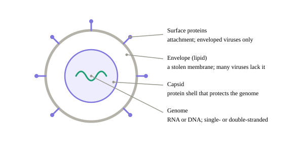
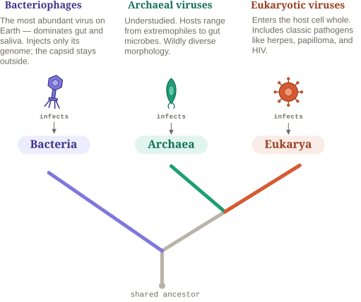
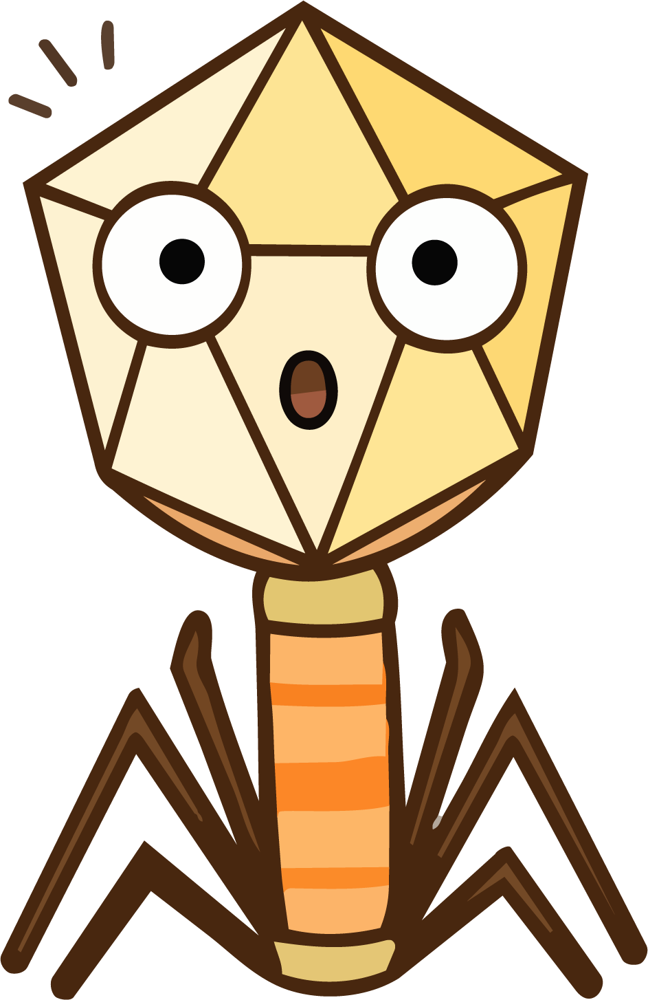

[District 1]{.district}

## The short answer

::: block
If you're coming from bacterial genomics or metagenomics, it's tempting to
assume viruses can be studied the same way.

[They can't.]{.claim}

Viruses don't follow a single experimental or computational workflow. Their
biology is extraordinarily diverse, and every methodological decision begins
with understanding what kind of virus you're actually looking for.

To understand why viruses require different approaches, you first need to
understand how they are built.
:::

## What are they made of?

:::: block
::: parts
- [1]{.n} [**Genome** — the nucleic acid (DNA or RNA); the instructions you sequence.]{.t}
- [2]{.n} [**Capsid** — the protein shell that packages and protects the genome.]{.t}
- [3]{.n} [**Surface / attachment proteins** — how it recognizes and enters a host.]{.t}
- [4]{.n} [**Envelope** *(optional)* — a lipid membrane borrowed from the host; only some viruses have one.]{.t}
:::

{#fig-anatomy fig-alt="Cross-section of a virion showing surface proteins, lipid envelope, capsid and genome."}

Their structure is simple: a piece of genetic material — RNA or DNA, single- or
double-stranded — wrapped in a protein shell called the **capsid**. Some viruses
add an outer **lipid envelope**, stolen from the host and studded with **surface
proteins** that help them latch onto host cells (like a coronavirus's spikes).

Each of those parts costs you a decision at the bench. The envelope changes how
the particle survives enrichment; the capsid is what lets you digest free
nucleic acid away before lysis; and whether the genome is DNA or RNA decides the
extraction — and whether the run needs a reverse-transcription step at all.
::::

::: insight
What a virus *is* decides how you handle it at the bench — pin this down before
you pick a protocol.
:::

## Three questions

::: block
Viral diversity can feel overwhelming. Instead of memorizing every viral family
or taxonomic group, let's organize this diversity around three questions:
:::

::: {.question .wide}
- Who do they infect?
- What kind of genome do they carry?
- What is their biological state?
:::

## Who do they infect?

::: block
[Every virus depends on a host.]{.claim}

Unlike cellular organisms, viruses cannot replicate on their own. They lack the
machinery needed to copy their genomes and instead rely on another living
organism to do the job. That organism is the **host**.

:::
::: fivi
{fig-alt="Fivi, thinking."}

**Don't look for us on the tree.** We aren't a branch of it — we're something
that happens to every branch. I infect bacteria; others infect archaea, and
others infect you.
:::
::: block

{#fig-tree .wide fig-alt="Tree of life showing which virus type infects each domain: bacteriophages infect Bacteria, archaeal viruses infect Archaea, eukaryotic viruses infect Eukarya."}

:::
::: methodology
Understanding the host is one of the first questions in viral research because it
shapes where viruses are found, how they evolve, and which experimental and
computational approaches are most appropriate.
:::

## What kind of genome do they carry?

::: block
Unlike other cellular organisms, viruses don't all use the same genetic
material. Their genomes may be DNA or RNA, and each can be either single- or
double-stranded.

:::: {.mx .wide}
::: mx-corner
:::

::: mh
RNA
:::

::: mh
DNA
:::

::: rh
One strand [(ss)]{.rh-sub}
:::

::: cell
{fig-alt="Single-stranded RNA genome."}

[ssRNA]{.cell-title}

coronavirus, influenza
:::

::: cell
{fig-alt="Single-stranded DNA genome."}

[ssDNA]{.cell-title}

Anelloviridae (TTV), Microviridae
:::

::: rh
Two strands [(ds)]{.rh-sub}
:::

::: cell
{fig-alt="Double-stranded RNA genome."}

[dsRNA]{.cell-title}

rotavirus
:::

::: cell
{fig-alt="Double-stranded DNA genome."}

[dsDNA]{.cell-title}

most phages, herpes, adenovirus
:::
::::

:::
::: methodology
Before you ever sequence a sample, these differences determine which workflows
are appropriate — and which ones will fail.
:::

## How do they exist?

::: block
[Not every virus exists as a free viral particle.]{.claim}

Some remain integrated within their host's genome for part — or even all — of
their lifecycle.

::::: state-tree
:::: st-row
::: st-main
[state · 1]{.num}

{fig-alt="A free viral particle outside a cell."}

[state: exogenous]{.badge}

[Exogenous]{.card-title}

A free particle that infects from outside — the classic virion.
:::

::: st-arrow
→ [can integrate into the host genome]{.st-note} →
:::

::: st-main
[state · 2]{.num}

{fig-alt="A viral genome integrated into host DNA."}

[state: endogenous]{.badge}

[Endogenous]{.card-title}

Genome written into the host's DNA — inherited or long-resident, not a free
particle.
:::
::::

:::: st-branch
[endogenous forms, by host]{.st-branch-label}

::: st-chips
::: chip
{fig-alt="Prophage integrated in a bacterial genome."}

**Prophages** [bacterial host]{.chip-sub}
:::

::: chip
{fig-alt="Provirus in an archaeal genome."}

**Proviruses** [archaeal host]{.chip-sub}
:::

::: chip
{fig-alt="Endogenous retrovirus in a eukaryotic genome."}

**ERVs** [eukaryotic host]{.chip-sub}

::: subchips
[retroviral]{.subchip} [non-retroviral (EVEs)]{.subchip}
:::
:::
:::
::::
:::::

:::
::: insight
Their biological state determines how they are detected — and whether they are
detected at all.
:::

::: fivi
{fig-alt="Fivi, surprised."}

**Don't overlook this axis.** Biological state may determine whether your
workflow finds me at all. We'll put this into practice in the
[How-to district](how-to.qmd).
:::

::: research
ERVs descend from retroviruses, which integrate into the host genome as a normal
step in their lifecycle. Non-retroviral EVEs come from viruses that never
integrate at all — fragments captured by accident and then inherited. The
distinction matters for detection: a search built around retroviral signatures
will not find the second kind.
:::
