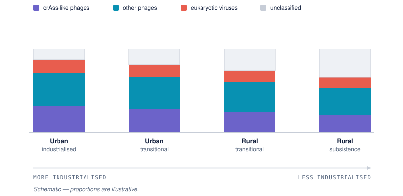
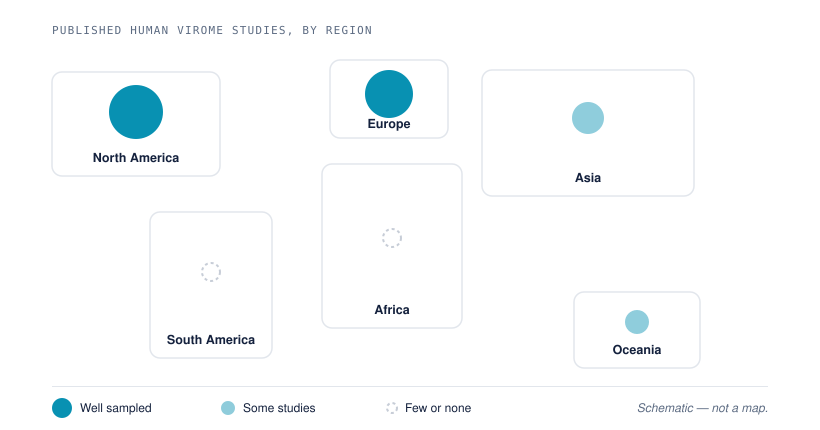

[District 3]{.district}

## The short answer

::: block
Viruses are found throughout the human body. They are among the most abundant
biological entities associated with us — but they are also among the smallest.
:::

::: fig-pending
**The viral world.** Viruses are everywhere in the body and outnumber
everything else, but they are tiny, and larger things crowd the frame.
:::

::: block
[However, most of what you sequence isn't viral.]{.claim}
:::

## Why isn't most of it viral?

::: block
To look for viruses, researchers often begin with shotgun metagenomic
sequencing (NGS), which sequences all nucleic acids in a sample — not just
viral ones.

The result is a sequencing library where viral sequences represent only a small
fraction of the total. In a stool sample, for example, bacterial, host and
dietary sequences vastly outnumber viral ones.
:::

::: fig-pending
**What is in the sample.** The composition of a stool library: host, bacterial
and dietary sequences against the sliver that is viral. Graphic, not
statistical — the proportions are illustrative.
:::

## Does it change with the body site?

::: block
That sliver isn't fixed — it varies enormously by where the sample came from.
Blood, lung and stool start from completely different mixes.
:::

::: embed
[Virome by body compartment]{.embed-title}

Toggle a variable and hover a compartment to see how the mix changes across the
body.

```{=html}
<iframe src="../components/body-heatmap.html" title="Virome by body compartment" loading="lazy"></iframe>
```

::: embed-out
[Open full ↗](../components/body-heatmap.html){target="_blank"} · [Compare all four side by side ↗](../components/body-heatmap-smallmultiples.html){target="_blank"}
:::
:::

## Is the site the whole story?

::: block
[Site isn't the whole story.]{.claim}

Sorting a human virome by collection site alone is too simplistic. The virome
shifts with many ecological traits of the host — age, sex, geography, even
social setting — and all of these belong in your experimental design. Two
examples: age, and geography.
:::

::: embed
[Viral richness across the lifespan]{.embed-title}

The first example. How many distinct viruses a person carries is not a constant
— it changes with age.

```{=html}
<iframe src="../components/richness-curve.html" title="Viral richness across the human lifespan" loading="lazy"></iframe>
```

::: embed-out
[Open full ↗](../components/richness-curve.html){target="_blank"}
:::
:::

::: block
The second example. Sampled in different populations, the same body site gives
different mixes — and the share that matches nothing in a reference database
grows as you move away from the places most of that reference was built from.

{#fig-geography fig-alt="Four stacked bars along an industrialisation axis, showing crAss-like phages, other phages, eukaryotic viruses and an unclassified fraction that grows toward less industrialised populations."}

That last band is not a property of the virus. It is a property of your
reference.
:::

## Why is so much of it unclassified?

::: block
Most published human virome studies come from a handful of regions, so the
databases you classify against are built mostly from those samples. A library
from an under-represented population will leave a larger unclassified fraction
than one from a well-sampled one — reading not as biology but as a pipeline
that failed.

{#fig-sampling fig-alt="Six world regions as schematic blocks, each with a circle sized by how much virome sampling it has: North America and Europe well sampled, Asia and Oceania with some studies, Africa and South America with few or none."}

Knowing which of the two you are looking at is part of designing the study, not
of troubleshooting it afterwards.
:::

::: insight
Every sample has the same problem underneath: the virus is a tiny fraction
buried under everything else. Recovering clean viral signal takes extra steps,
and even after them the host and microbial noise is still there.
:::

::: fivi
{fig-alt="Fivi, thinking."}

**How you pull me out depends on what I'm made of and how I live.** There is no
single recovery protocol — which steps you need is decided by the genome I carry
and the state I'm in. That's the [How-to district](how-to.qmd).
:::
