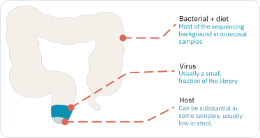
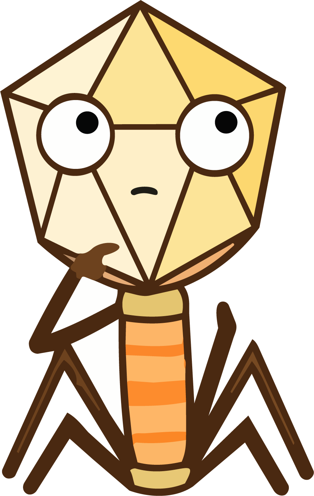

[District 3]{.district}

## The short answer

::: block
From the Antarctic ice, the deep sea and every gram of soil to your fingernail.
Nobody has yet looked into an ecosystem and found it free of them.

The human body is one of those ecosystems, and it is the one this book is about.
:::

::: fig-pending
**The viral world.** Viruses are everywhere in the body and outnumber
everything else, but they are tiny, and larger things crowd the frame.
:::

::: block
But being everywhere does not make them easy to find:

[Most of what you sequence isn't viral.]{.claim}
:::

## Why isn't most of it viral?

::: block
Today the most common way to study viral diversity and discover new viruses is
shotgun metagenomic sequencing. But shotgun is not virus-specific: it reads
every nucleic acid in the sample, and viral genomes are a small minority of what
is there. In a stool sample, for example, bacterial, host and dietary sequences
vastly outnumber viral ones.

And a virus carries very little of it. Tens of kilobases against the few
megabases of the bacterium it infects. Abundance is counted in particles;
sequencing is counted in bases.
:::

{#fig-stool fig-alt="A colon, coloured along its length: almost all of it is bacterial and dietary background, with a small viral fraction and a host fraction at the end."}

::: insight
This is one of the biggest challenges in exploring a human virome. You will see
the techniques for dealing with it in the [How-to district](how-to.qmd).
:::

## Does it change with the body site?

::: block
Have you ever seen a tiger at the North Pole, or a baobab growing in
Switzerland? Living things belong to specific ecosystems, decided by their
physiology and their evolution. The microorganisms are no different, viruses
included.

The human body is not one habitat but many. The gut is warm, crowded and without
oxygen; the skin is dry, salty and exposed. Different conditions, different
diversity (richness and abundance).
:::

::: block
Here is a closer look at what you would find across four body sites, if you
sequenced each of them in bulk.
:::

::: embed
[What's in the sample?]{.embed-title}

Sequencing reads everything. What competes with your virus, and whether you can
recover it at all, depends on where the sample came from. Click a column.

```{=html}
<iframe src="../components/whats-in-the-sample.html" title="What is in the sample: host, background and viral fraction across four body sites" loading="lazy"></iframe>
```

::: embed-out
[Open full ↗](../components/whats-in-the-sample.html){target="_blank"}
:::
:::

::: block
Each site differs in what lives there. It also differs in how hard it is to
reach: how much host you are fighting, how little material you have to start
from, and how much of what you detect never came from the body at all.
:::

::: embed
[Virome by body compartment]{.embed-title}

Toggle a variable and hover a compartment to see how the mix changes across the
body.

```{=html}
<iframe src="../components/body-heatmap.html" title="Virome by body compartment" loading="lazy"></iframe>
```

::: embed-out
[Open full ↗](../components/body-heatmap.html){target="_blank"} · [Compare all four side by side ↗](../components/body-heatmap-smallmultiples.html){target="_blank"}
:::
:::

## Is the site the whole story?

::: block
[Site isn't the whole story.]{.claim}

Sorting a human virome by collection site alone is too simplistic. The virome
shifts with many ecological traits of the host — age, sex, geography, even
social setting — and all of these belong in your experimental design.

Age is the one with the clearest shape.
:::

::: embed
[Viral richness across the lifespan]{.embed-title}

How many distinct viruses a person carries is not a constant — it changes with
age.

```{=html}
<iframe src="../components/richness-curve.html" title="Viral richness across the human lifespan" loading="lazy"></iframe>
```

::: embed-out
[Open full ↗](../components/richness-curve.html){target="_blank"}
:::
:::

::: block
And it is not alone. Everything from where you were born to what you took last
month has been measured against the virome, and the findings sort themselves
along one axis: how early and how structural the exposure is.
:::

::: embed
[What shapes a virome, and how much]{.embed-title}

Each bubble is a published finding, placed by how early and structural the
exposure is and sized by how large the reported effect was. Filled means a
lasting imprint; hollow means reversible. Hover any bubble for the finding and
its DOI.

```{=html}
<iframe src="../components/lifestyleviromefigure.html" title="Lifestyle and ecological factors that shape the human virome, ranked from structural and early to everyday and reversible" loading="lazy"></iframe>
```

::: embed-out
[Open full ↗](../components/lifestyleviromefigure.html){target="_blank"}
:::
:::

## Why is so much of it unclassified?

::: block
The databases you classify against were built from public metagenomes, and those
metagenomes did not come from everywhere. More than 71% of public human
microbiome samples with a known origin come from Europe, the US and Canada —
46.8% from the US alone, a country holding 4.3% of the world's population. A
library from an under-represented population will leave a larger unclassified
fraction than one from a well-sampled one, and it will read not as biology but
as a pipeline that failed.
:::

::: embed
[Public samples per country, relative to population]{.embed-title}

Hover a country to see how much of that population has been sampled, and which
virome papers studied it. The sampling data is microbiome-wide rather than
virome-specific — but the four major gut virome catalogues were built by mining
these same public metagenomes, so this is the substrate your reference was
assembled from.

```{=html}
<iframe src="../components/sampling-map.html" title="Public human microbiome samples per country, relative to population" loading="lazy"></iframe>
```

::: embed-out
[Open full ↗](../components/sampling-map.html){target="_blank"}
:::
:::

::: insight
All of this is ecology. A person is an ecosystem, and ecosystems move when small
things change — a course of antibiotics, a move to a city, a different diet.
When your subjects are people, their circumstances are not context around the
study. They are variables in it, and they belong in the design.
:::

::: fivi
{fig-alt="Fivi, thinking."}

**How you pull me out depends on what I'm made of and how I live.** There is no
single recovery protocol — which steps you need is decided by the genome I carry
and the state I'm in. That's the [How-to district](how-to.qmd).
:::
